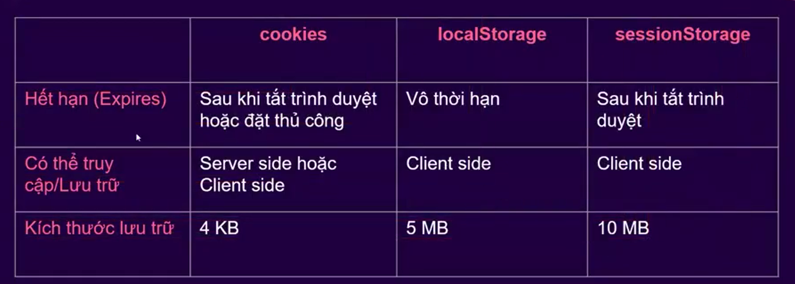

### ------------- Storage API --------------------------------

## localStorage

-> là kho lưu trữ ở phía "client"
-> lưu trữ dữ liệu "vô thời hạn"
=> chỉ bị xóa bằng javascript hoặc clear bộ nhớ
hoặc xóa bằng localStorage API
-> dữ liệu sẻ được lưu trữ cho tới khi "user" xóa lịch sử trình duyệt website
-> Lưu trữ được (5MB) -> lưu được lượng thông tin lớn hơn "sessionStorage" và "cookie"
-> Không gửi thông tin lên "serve"r như "cookie" -> bảo mật tốt hơn

# localStorage method:

# setItem(): thêm dữ liệu vào localStorage -> setItem(key,value)

# getItem(): lấy dữ liệu từ localStorage -> getItem(key)

# removeItem(): xóa dữ liệu ra khỏi localStorage (theo key chỉ định)

# clear(): xóa toàn bộ dữ liệu ra khỏi localStorage

# key(index): lấy ra tên key tương ứng được lưu trữ trong localStorage

# Xem thông tin localStorage:

-> Nhấn "F12" hoặc "Ctrl + Shift + i"
-> Chọn tab "Application"
-> Chọn "Storage"

## sessionStorage

-> Lưu trữ ở phía "client"
-> Dữ liệu không gửi lên "server"
-> thông tin lưu trữ nhiều hơn "cookie" ít nhất 5MB
-> Là kho lưu trữ theo "phiên"
-> Lưu trữ cho một phiên làm việc
-> Có nghĩa là dữ liệu sẻ "mất" khi "close browser"

# sessionStorage method:

# setItem(): thêm dữ liệu vào sessionStorage -> setItem(key,value)

# getItem(): lấy dữ liệu từ sessionStorage -> getItem(key)

# removeItem(): xóa dữ liệu ra khỏi sessionStorage (theo key chỉ định)

# clear(): xóa toàn bộ dữ liệu ra khỏi sessionStorage

# key(index): lấy ra tên key tương ứng được lưu trữ trong sessionStorage

## cookies

